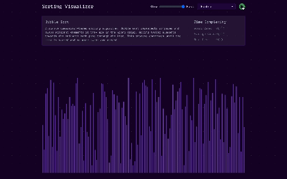
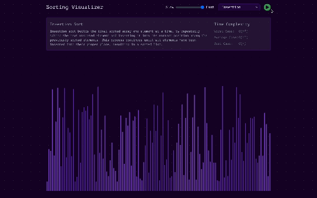
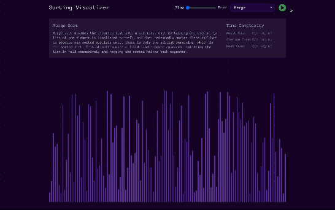
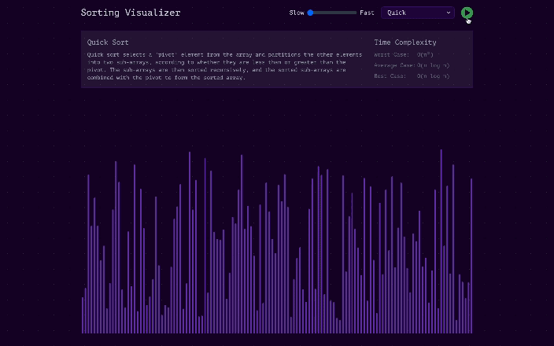
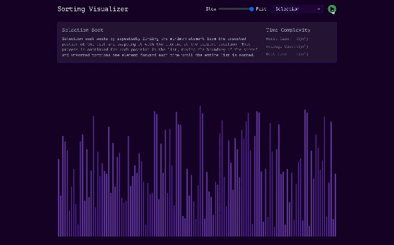

## Demo

**Note**: The demo provided is of lower resolution. Apologies for any inconvenience caused.

---

### Bubble Sort - O(n2)

---
### Insertion Sort - O(n2)

---

### Merge Sort - O(n log n)

---

### Quick Sort - O(n log n)

---

### Selection Sort - O(n2)

---
